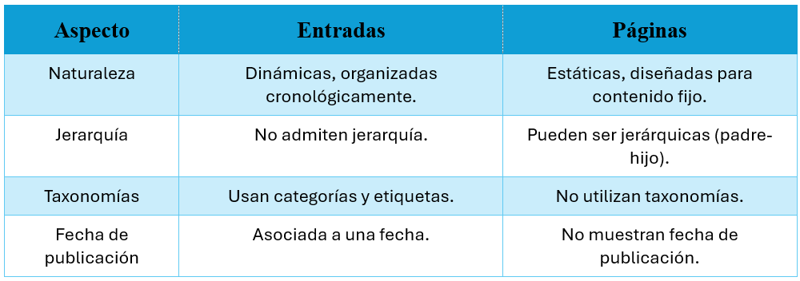

# Páginas 📄  

Las **páginas** en WordPress son **estáticas** y están diseñadas para contenido más **permanente**, como **"Inicio"**, **"Contacto"** o **"Acerca de nosotros"**. A diferencia de las **entradas**, las páginas **no están organizadas cronológicamente**.  

📌 **Acceso:**  
1. Desde el **menú lateral**, selecciona **Páginas > Todas las páginas**.  

---

## Acciones Principales ⚙️  

### 1. **Crear una Nueva Página** ➕  
   - Haz clic en **Añadir nueva**.  
   - Escribe el **título de la página**.  
   - Usa el **editor de bloques** para estructurar el contenido.  
   - Configura los siguientes elementos clave:  
     - **Atributos de página** 🏷️  
       - **Página padre**: Define si esta página depende de otra, creando una **jerarquía**.  
       - **Plantilla**: Elige una plantilla predefinida si el tema lo permite.  
   - **Opciones de publicación:**  
     - **Publicar inmediatamente**.  
     - **Guardar como borrador**.  
     - **Programar la publicación** para una fecha específica.  

---

### 2. **Editar una Página Existente** ✏️  
   - Desde la lista de páginas, haz **clic en el título de la página** para realizar cambios en su contenido o diseño.  

---

### 3. **Eliminar una Página** 🗑️  
   - Selecciona una o más páginas de la lista.  
   - Elige **Mover a la papelera** y confirma la acción.  

---

## Diferencias Clave entre Entradas y Páginas 🔄  

  

---

## Buenas Prácticas en la Gestión de Entradas y Páginas ✅  

- **Organización Clara**  
    - Usa **categorías y etiquetas** en las **entradas** para mejorar la navegación.  
    - Crea una **jerarquía lógica** en las **páginas**, como una página principal con subpáginas.  

- **Optimización SEO**  
    - Añade **títulos claros, imágenes optimizadas y metadescripciones** relevantes.  

- **Revisión Periódica**  
    - **Actualiza el contenido obsoleto** en las páginas.  
    - **Ajusta las entradas** según las necesidades del sitio.  

- **Pruebas antes de Publicar**  
    - **Previsualiza el contenido** para verificar su diseño y legibilidad.  

- **Copias de Seguridad** 🔄  
    - **Realiza respaldos regulares** para evitar pérdida de datos.  

---

✅ **Las páginas permiten estructurar el sitio de manera organizada y permanente**, mientras que las entradas son ideales para contenido dinámico y actualizado.  
